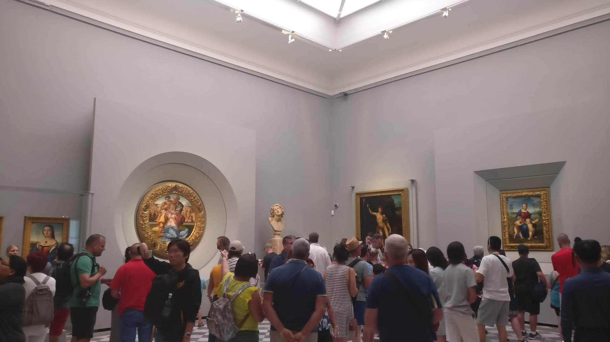
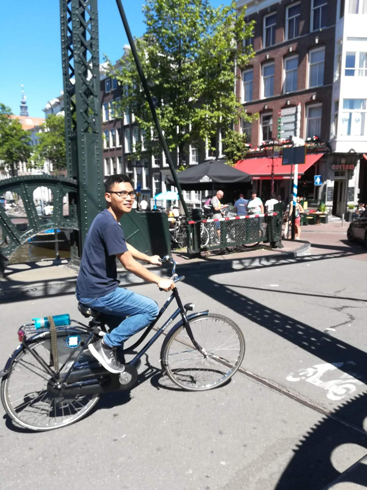
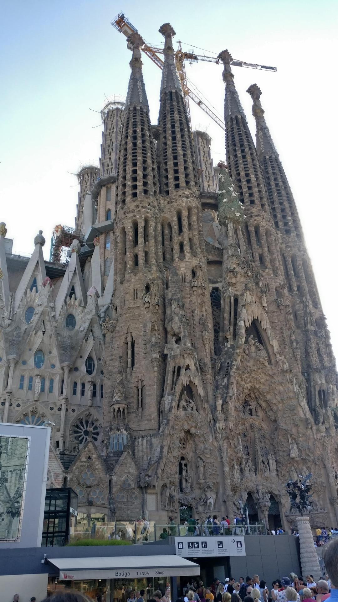

Januari lalu gua dapet kesempatan buat magang di Jerman selama 6 bulan. Masyaallah. Sebenernya dapet magangnya mendadak dan ngga terduga-duga sama sekali. Tapi pas sampe sana terjadi suatu hal yang lebih ngga masuk akal.

## München

Sampe di München tanggal 10 Januari 2019 jam 7 pagi. Tapi anehnya langit masih gelap gurita. Pas turun pesawat, wuow, salju. 

Waktu itu ternyata lagi tebel tebelnya salju di München. Geret geret koper dari stasiun kereta ke rumah pun susah, karena saljunya hampir selutut.

*Salju depan rumah*

Disana dapet rumah yang isinya anak-anak magang yang beda perusahaan dan beda negara asal. Ternyata isi rumahnya asik asik abis. Ada yang dari Turki, Pakistan, Moroko, Venezuela, dan Tunisia.

Main bowling bareng. Makan malem bareng, bikin boneka salju bareng sama, jalan-jalan ke Austria bareng, main uno bareng, jalan ke Praha bareng, ke mekdi bareng, buka puasa bareng, mereka ke ke bar dan clubbing bareng, gua ngga ikut haha.

*Bareng sama bocah rumah ke Austria*

*Perang salju dan bikin snowman, merek spidol*

## Magang

Dari rumah ke kantor sekitar 35 menit. Naik u-bahn U3, turun Marineplatz, lanjut naik tram nomor 21 ke Leonrodplatz.

Gua dapet magang di startup namanya Blik. Disana kita bikin alat tracking yang di tempelin ke kontener. Target pasarnya produsen-produsen yang punya gudang. Dengan alat kita mereka lebih mudah tau kontener mereka lagi ada dimana, jumlahnya berapa, kapan pindah dari gudang satu ke gudang lainnya.

Disana gua ditempatin di bagian frontend bareng Chris, anak UK yang baru beres S2 disana. Chris orangnya baik banget. Hari pertama gua disana gua diajarin dari awal tentang kode kode udah ada. Untungnya karena mereka make React, dan gua udah beberapa kali bikin proyek make React juga, jadi langsung familiar sama kode yang ada.

*Meja di kantor. Setiap pagi gua ngambil sereal, walaupun di rumah udah makan nasi telor.*

Karena blik masih kecil startupnya, semua orang yang kerja tau seluruh perkembangan perusahaan.

Walaupun tahun sebelumnya blik dapet investment lebih dari satu juta euro, tapi secara finansial blik belum menguntungkan. 

Dulu kita pernah ngadain pilot project sama beberapa perusahaan mobil di München, tapi belum ada yang jadi konsumer tetap. Karena belum banyak pemasukan, untuk bisa bertahan satu-satunya cara cuma ambil uang dari investor lagi. Namun sayangnya selalu ada masalah ketika nyari customer baru dan alhasil susah mencari investor.

## Keputusan

Kerjaan berjalan normal seperti biasa sampe suatu hari di akhir April 2019. Pas jam 9 pagi, kita semua dikumpulin di suatu ruangan sama founder-foundernya.

Lalu salah satu foundernya bilang gini kira kira,

"Yaa ini sebenernya bakal berat banget buat kalian, dan jauh lebih berat lagi buat kami.."

"Setelah diskusi dengan investor, kami memutuskan untuk menutup perusahaan ini."

...

Gua dan semua karyawan disana cuma ngeliat satu sama lain, ngga tau harus reaksi apa.

"Hari ini kalian boleh pulang, besok ketemu kita buat diskusi one on one untuk kedepannya gimana."

Untungnya, perlindungan pekerja di Jerman itu baik, dan founder-foundernya sangat peduli sama karyawannya. Untuk karyawan tetap, mereka dikasih waktu 3 bulan untuk nyari kerjaan baru. Dan selama 3 bulan itu, selama belum dapet kerja baru, bakal tetep dapet gaji utuh tiap bulannya.

Untuk kasus magang gua, walaupun mereka mutusin buat nutup perusahaan, mereka juga ngga bisa mutus satu arah dari pihak sana aja. Jadi mereka nawarin **3 pilihan**:
1. Gua mutusin kontrak magang dari pihak guanya, dan dibeliin tiket pulang ke Indonesia. Mayan lah 8jtan.
2. Dicariin startup lain buat lanjutin magang sampe Juli. 
3. Kontraknya tetep sampe Juli. Tetep digaji kayak biasa sampe Juli. Tapi udah ngga usah kerja apa-apa lagi.

Di hari itu gua jalan dari kantor ke Olympiapark sama Chris, meratapi apa yang baru aja terjadi.

Di hari itu juga gua nelfon ayah ibu buat diskusi harus ngambil pilihan yang mana.

Setelah diskusi dan istikharah, gua memutuskan untuk mengambil pilihan ke-3: Tetep digaji sampe Juli, tapi udah ngga usah kerja lagi.

Mungkin gua bakal ngambil pilihan ke 2, kalo sebelumnya gua belum magang 7 bulan di Thailand. Tapi karena waktu itu total magang gua udah 1 tahun, udah bosen juga jadi anak magang.

Lagipula kapan lagi ada kesempatan jalan-jalan di Eropa dan dibayar setiap bulannya haha.

## Jalan-jalan

Sebelum jalan-jalan, gua mutusin buat tinggal ke Berlin selama sebulan, untuk ngehemat biaya rental, dan biar fokus Bulan Ramadhan. Disana gua tinggal bareng Affan, temen SMA gua yang lebih jayus.

*Lebaran bareng temen SMA di KBRI Berlin*

Setelah lebaran, waktunya planning perjalanan.

Di Eropa ada maskapai yang terkenal murah, namanya Ryanair. Tiket pesawat gua dari Berlin ke Milan itu cuma 15€ atau sekitar 230rb rupiah. Tiket bis atau kereta ngga ada yang bisa nyaingin.

Kekurangannya, cuma boleh bawa satu tas. Kalo mau nambah bagasi nambah ~20€. Lebih mahal dari harga tiketnya. Yaudah daripada nambah ~20€ setiap terbang, jadi selama keliling eropa gua cuma bawa 6 kaos buat atasan.

Buat nyari tiket pesawat, gua make Skyscanner dan Google Flight. Karena rutenya bebas, jadi gua nyari tiket termurah yang terbang dari kota itu. Waktu itu tiket termurah dari Berlin itu ke Milan. Jadi perjalanan keliling eropa gua dimulai dari Milan.

### Milan

Kota yang gua datengin karena tiket termurahnya ke sini. Biasa sih kotanya kalo dibandingin kota-kota selanjutnya.

*Duomo di Milano*

### Pisa

Dari Milan naik bis ke Pisa. Rasanya ngeliat bangunan yang selama ini cuma ngeliat di buku-buku pas SD ituu... Cobain sendiri deh ya haha

### Florence

Dari Pisa lanjut ke Florence, penasaran sama kota pusat zaman Rennaisance. Disana muter-muter museum, termasuk Uffizi, ngeliat hasil karya Michelangelo dan kawan-kawan.

*Suasana Galeri Uffizi*

*Pemandangan Florence*

### Roma

Dari Florence naik kereta ke Roma. Roma kece banget. Gua nyesel cuma 2 hari disana. Keliling Colosseum makan waktu sehari. Di sekitar Colosseum banyak tempat yang gua ngga sempet ngunjungin kayak Roman Plaza.

Untungnya pas disana masih sempet buat ngunjungin Vatikan. Gua baru sadar Vatikan tuh kecil. Lebih kecil dari perumahan rumah gua mungkin. Di Vatikan ada Sistine Chapel yang wuaw.

*Colosseum. Gambar Sistine Chapel cari sendiri ya hehe.*

### Aarhus

Empat tahun yang lalu gua ada kesempatan lomba ke Aarhus, Denmark. Empat tahun lalu gua gagal lolos seleksinya. Sejak hari itu, hati kecil gua pengen ke sana. 

Masyaallah kesampean. Tujuan kesana cuma mau foto sama tulisan Aarhus doang sih haha

*Muka gua gede ya.*

### Copenhagen

Ke Copenhagen karena tanggung aja karena udah dari Aarhus. Kota nya damai, ngga serame ibukota lain. Lumayan lah pernah ngerasain negara Scandinavia.

*The Royal Library. Sambil jalan-jalan sambil ngerjain proyek.*

### Brussel

Brussel, Belgia, terkenal ada markas European Union, dan ada patung bocah pipis.

*Mannekin Pis. Udah patungnya gitu doang. Aslinya ngga jauh beda dari foto.*

### Den Haag

Setelah perjalan sendiri, di kota ini gua udah janjian sama Alief, temen SD. Mantepnya Alief nih punya kenalan guru di Den Haag, jadi dapet tempat tinggal, jamuan, dan dianterin kemana-mana. Makasih ya om hehe.

*Kata emak gua difoto ini gua kayak artis. Padahal jasnya dapet gratisan dari mesjid karena dingin disana dan gua cuma bawa kaos.*

### Amsterdam

Kami lanjut ke Amsterdam. Kami nyewa sepeda buat sehari. Menyusuri kanal-kanal kecil. Menghirup asap ganja. Naik ferry melintasi sungai. Foto-foto make sepeda. Menghirup asap ganja lagi. Sekilas ke Red Light District pas siang-siang. Terus ke Mesjid buat tobat haha.

*Puluhan kali nyoba video naik sepeda sambil lepas tangan. Ngga ada yang bagus. Yang ada hampir nyebur.*

Alief cuma sampe Amsterdam aja karena ada kuliah. Gua ngga ada kuliah dan ngga ada kerja jadi lanjut ke Paris haha.

### Paris

Di kota-kota lain gua cuma 1-2 hari. Di Paris 2.5 hari. Kuranggggg. Banyak yang pengen diliat. Kotanya gede. Di Eiffel seharian cuma duduk ngga bosen-bosen. Di Museum Louvre kalo mau mantengin Mona Lisa nya aja boleh sehari kalo mau dan ngga diusir satpam. Belum koleksi-koleksi Louvre yang lain. Belum tempat-tempat lain kayak Versailles.

*Bibi Mona Lisa dari jarak beberapa meter*

### Barcelona

Sebenernya tiket ke Barcelona mahal. Kalo tiket pesawat lain <20€. Ke Barcelona ~50€. Tapi apa daya pengen merasakan semua negara besar di Eropa.

*La Sagrada Familia*

*Pantai Barcelona. Abis dari sini langsung hilang iman.*

### Zürich

Dari Barcelona terbang lagi ke Zürich, Swiss, sebagai destinasi terakhir. Kota nya okeee banget. Bersih, modern, damai, tentram, sejahtera. Disini berasa orang-orangnya punya standar hidup yang tinggi.

*Pemandangan dari ETH Zürich. Aslinya lebih keren lagi.*

### Itung-itungan

Kalo di rata-rata, biaya per hari kasarnya:

- Hostel: 20€
- Tiket antar kota: 20€
- Tiket dalam kota: 10€
- Tiket museum/entry lain: 10€
- Makan 3x: 15€
- Es krim: 5€

Total: ~80€/hari

Ini masih bisa lebih murah atau lebih mahal, tergantung pinter-pinter nyari promo dan mau sehemat apa.

Perjalanan kira-kira 21 hari. 80 x 21 = 1680€. Gaji disana perbulan bersihnya dapet ~1100€. Karena udah ngga kerja lagi tapi masih dibayar, masyaallahnya jadi selama 21 hari itu bisa dibilang dibayar buat jalan-jalan.

## Indonesia

Sampe sekarang, gua masih ngerasa perjalanan kemarin itu kayak mimpi.

Menurut gua, perjalanan kemarin itu 50% hasil dari usaha gua. Gua mulai belajar programming 4 tahun yang lalu. Sabtu minggu dipake buat belajar atau bikin proyek. Lagi kuliah pun malah belajar programming. Ilang duit Rp 10jt buat gaya-gayaan bikin startup. Sampe gua makin rajin pas dikatain sama ayah gua, "Fikri, kamu udah belajar programming lama kok belum ada hasilnya."

Tapi menurut gua perjalanan gua itu 100% nya lagi dari Allah. Waktu itu iseng-iseng daftar magang cuma karena lagi bosen dikelas pas kuliah. Pas dikasih tes ngoding ngerasa gampang karena udah pernah ngerjain proyek yang sama sebelumnya. Pas interview lancar karena ayah gua udah ngajarin bahasa inggris dari SD. Dan entah kenapa mereka mau nerima gua yang kuliah beda jurusan. Entah kenapa lagi mereka bangkrut tapi masih bela-belain ngegaji karyawannya.

Banyak orang yang belajar programming jauh lebih lama dari gua, tapi belum dapet kesempatan yang sama.

Jadi ya usaha aja, trus terserah nantinya gimana.