Januari lalu gua dapet kesempatan buat magang di Jerman selama 6 bulan. Beh keren banget masyaallah. Sebenernya dapet magangnya pun mendadak dan ngga terduga-duga sama sekali. Tapi pas sampe sana terjadi suatu hal yang lebih ngga masuk akal.

## München

Sampe di München tanggal 10 Januari 2019 jam 7 pagi. Tapi anehnya langit masih gelap gurita. Pas di pesawat dikasih tau sama orang disebelah kalo bisa pas landing udah siap jaket tebel dan celana dobel. Pas turun pesawat, wuow, salju. 

Waktu itu ternyata lagi tebel tebelnya salju di München. Geret geret koper dari stasiun kereta ke rumah pun susah banget, karena saljunya hampir selutut.

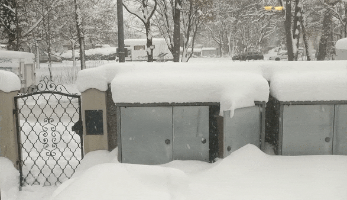

*Salju depan rumah*

Di München terkenal susah banget nyari tempat tinggal. Banyak yang bilang di sana lebih susah nyari rumah daripada nyari kerjaan. Untungnya sebelum kesana udah dapet kamar di rumah yang isinya anak anak magang juga, walaupun perusahaan dan negara asalnya beda beda.

Ternyata isi rumahnya asik asik banget. Ada yang dari Turki, Pakistan, Moroko, Venezuela, dan Tunisia. Baru minggu-minggu pertama, gua lagi tidur tiba tiba ditarik ke tempat bowling. Makan malem bareng, bikin boneka salju bareng, jalan-jalan ke Austria bareng, main uno bareng, jalan ke Praha bareng, mereka ke ke bar dan clubbing bareng, gua ngga ikut haha.

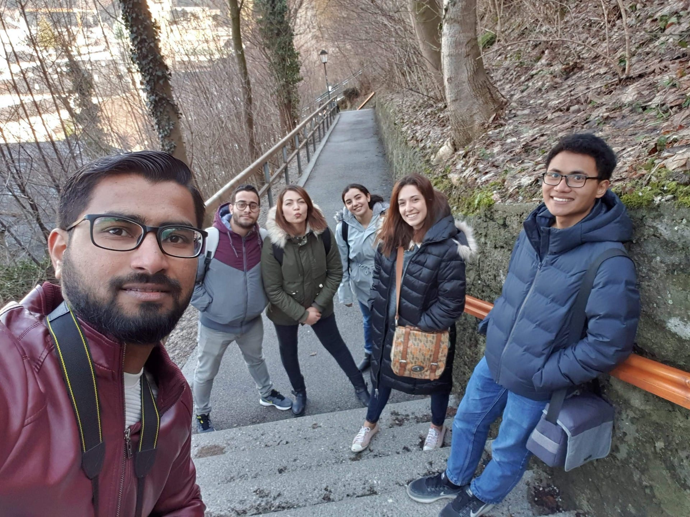

*Bareng sama bocah rumah ke Austria*

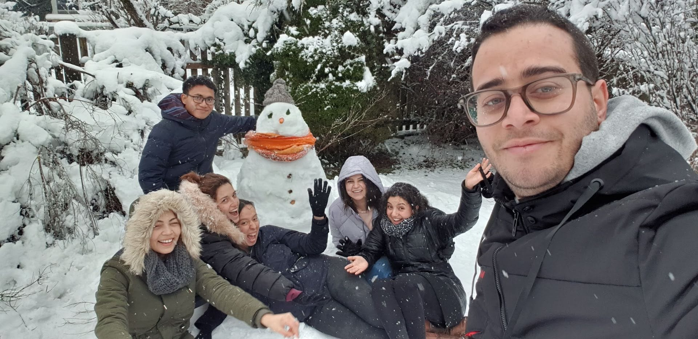

*Perang salju dan ngebuat boneka salju atau snowman, merek spidol*

Kalo mau beli makanan dari luar disana mahal banget. Yang paling murah itu kebab, sekitaran €4-€5, atau Rp 80.000 an sekali makan. Untungnya ayah gua maksa ngebawain rice cooker. Akhirnya selama di sana makan nasi telor garem setiap hari, dan ke tempat kerja pun bawa bekel biar tetep bisa makan akhir bulan.

Temen-temen rumah selalu ngatain gua karena makan nasi tiap hari. Gua dikatain matanya sipit karena makan nasi. Tapi setelah kita sering makan malem bareng, dan sharing makanan, mereka jadi pada doyan makan nasi. Ada yang bilang sebulan dia disana dia makan nasi lebih banyak daripada seumur hidupnya. Ada yang pas gua balik ke indo dia mau beli rice cooker sendiri haha.

Karena beberapa dari mereka dari negara muslim juga, salah satu yang paling seru itu pas Ramadhan. Puasa bareng, buka puasa bareng. Cewe-cewe Moroko dan Tunisia nya jago banget masak. Menu bukaannya ada 7 macam lebih. Makanan khas Moroko dan Tunisia. Untungnya gua juga jago masak. Masak nasi make rice cooker.

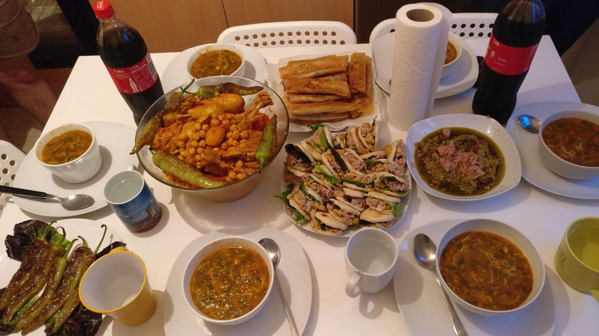

*Buka puasa bersama. Untungnya nasi gua ngga harus keluar*

## Magang

Dari rumah ke kantor sekitaran 35 menit. Naik u-bahn U6, turun Marineplatz, tengah kota 
München, lanjut naik tram nomor 21 ke Leonrodplatz.

Gua dapet magang di startup namanya Blik. Disana kita bikin alat tracking yang di tempelin ke kontener. Target pasarnya produsen produsen yang punya gudang yang gede banget. Jadi dengan alat kita mereka jadi lebih mudah taunya kontener mereka lagi ada dimana. Jumlahnya berapa. Kapan mereka pindah dari gudang satu ke gudang lainnya.

Disana gua ditempatin di bagian frontend, bareng Christoper Hogg, anak UK yang baru beres S2 disana. Chris orangnya baik banget. Hari pertama gua disana gua diajarin dari awal banget tentang kode kode udah ada. Untungnya karena mereka make React.js, dan gua udah beberapa kali bikin proyek make React.js juga, jadi gua udah familiar sama kode yang ada.

Proyek proyek yang dikerjain disana lumayan seru. Di awal awal ngebenerin bug-bug yang udah ada lama di aplikasinya. Trus ningkatin performa aplikasinya dengan ganti beberapa struktur program. Bikin tes tes otomatis untuk mempermudah ngoding di kemudian hari.

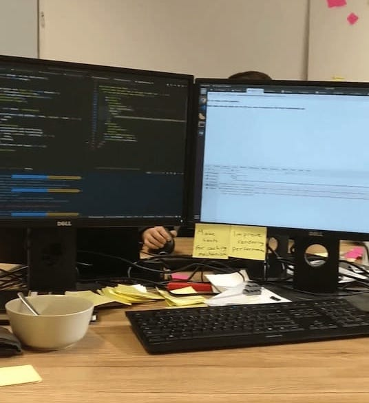

*Meja di kantor. Setiap pagi gua ngambil sereal, walaupun di rumah udah makan nasi telor.*

Blik itu masih kecil startupnya. Total karyawannya kira-kira ada ~15an. Dan itu terbagi jadi tim engineering dan tim sales. Karena masih kecil, jadi semua orang disana tau apa yang terjadi di perusahaan itu. Setiap pagi kita ada meeting yang ngebahas tentang progress seminggu sebelumnya, dan apa yang bakal kita kerjain di minggu itu.

Karena itu tim engineering juga tau progress yang ada di tim sales.

Walaupun tahun sebelumnya udah dapet investment lebih dari satu juta euro, tapi secara finansial blik belum menguntungkan. Target-target sales pun setiap meeting selalu ada masalah tidak terduga.

Dulu kita pernah ngadain pilot project sama beberapa perusahaan mobil di 
München, tapi masih belum ada yang jadi konsumer tetap. Karena belum banyak pemasukan, untuk bisa bertahan satu-satunya cara cuma ambil uang dari investor lagi.

Sejak Februari 2019 kita udah targetin dapet customer sekian banyak, untuk bisa nyari investor tambahan lagi. Namun sayangnya selalu ada masalah ketika mau tanda tangan kontrak sama customer baru.

## Keputusan

Kerjaan berjalan normal seperti biasa sampe suatu hari di akhir April 2019. Di pagi itu, jam 9 pagi, kita semua dikumpulin di suatu ruangan sama founder foundernya juga.

Lalu salah satu foundernya bilang gini kira kira,

"Yaa ini sebenernya bakal berat banget buat kalian, dan jauh lebih berat lagi buat kami.."

"Setelah diskusi dengan investor, kami memutuskan untuk menutup perusahaan blik ini."

...

"Hari ini kalian boleh pulang, tolong pikirin hal yang terjadi ini, dan besok ketemu kita buat diskusi one on one untuk kedepannya gimana."

Atmosfir di kantor pun jadi sangat aneh.

Untungnya, perlindungan pekerja di Jerman itu baik banget, dan founder-foundernya pun sangat peduli sama karyawannya. Untuk karyawan tetap, mereka dikasih waktu 3 bulan untuk nyari kerjaan baru. Dan selama 3 bulan itu, kalo belum dapet kerja, bakal tetep dapet gaji utuh, walaupun udah ngga kerja lagi.

Untuk kasus magang gua, mereka juga ngga bisa mutus satu arah dari pihak sana aja. Jadi mereka nawarin 3 pilihan:
1. Gua mutusin kontrak magang dari pihak guanya, dan dibeliin tiket pulang ke Indonesia. Mayan lah 8jt.
2. Dicariin startup lain buat lanjutin magang sampe Juli. 
3. Kontraknya tetep sampe Juli. Tetep digaji kayak biasa sampe Juli. Tapi udah ngga usah kerja apa-apa lagi.

...

Di hari itu gua jalan-jalan muter muter dari kantor ke Olympiapark. Kita ngobrolin masa masa kerjaan selama ini, dan apa yang bakal terjadi kedepannya. Di hari itu juga gua langsung nelfon ayah ibu buat diskusi harus ngambil pilihan yang mana.

Setelah diskusi, istikharah dan bla bla, akhirnya gua memutuskan untuk mengambil pilihan ke... 3.

Kalo sebelumnya gua belum magang 7 bulan di Thailand, kayaknya gua bakal ngambil pilihan ke 2. Tapi karena disaat memutuskan itu total magang gua udah 1 tahun, jadi udah rada bosen juga jadi anak magang.

Kapan lagi jalan-jalan di Eropa dan dibayar setiap bulannya hehe.

## Jalan-jalan

Sebelum jalan-jalan, gua mutusin buat tinggal ke Berlin selama sebulan, untuk ngehemat biaya rental, dan biar fokus Bulan Ramadhan. Disana gua tinggal bareng Affan, temen SMA gua yang lebih jayus. Di Berlin ada Mesjid Indonesia namanya IWKZ, yang nyaman banget buat ngapa-ngapain.

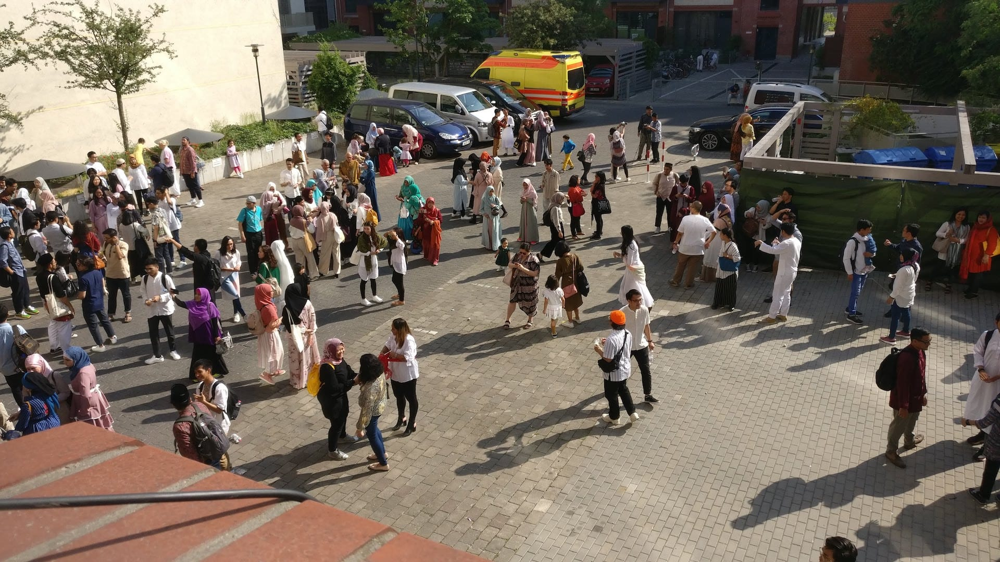

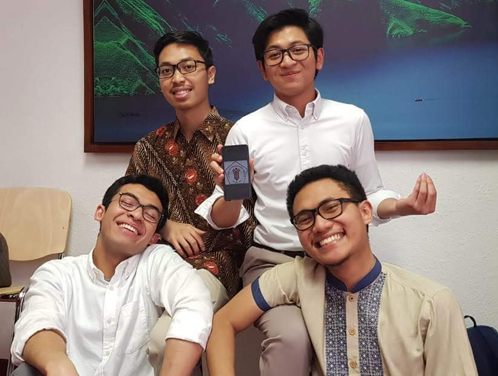

*Lebaran bareng temen SMA di KBRI Berlin*

Setelah ngehemat uang sebulan selama Ramadhan, waktunya beli tiket buat keliling eropa.

Di Eropa ada maskapai yang terkenal murah banget, namanya Ryanair. Tiket pesawat gua dari Berlin ke Milan itu cuma 15 euro atau sekitar 230rb rupiah. Jauh lebih murah dari tiket pesawat di Indonesia ngga sih. Tiket bus atau kereta pun ngga ada yang bisa nyaingin.

Tapi kekurangannya, cuma boleh bawa satu tas gemblok yang kecil. Kalo mau nambah bagasi nambah ~20 euro. Lebih mahal dari harga tiketnya. Yaudah daripada nambah ~20 euro setiap terbang, jadi selama keliling eropa gua cuma bawa 6 kaos. 

Buat nyari tiket pesawat termurah, kemarin gua make Skyscanner dan Google Flight. Karena rutenya bebas banget, jadi biasanya gua nyari tiket termurah yang terbang dari kota itu. Misalkan karena awalnya dari Berlin, kemarin nyari tiket termurah dari Berlin untuk tanggal tertentu. Waktu itu tiket termurah dari Berlin itu ke Milan. Jadi perjalanan keliling eropa gua bermulai dari Milan.

### Milan

Kota yang gua datengin karena tiket termurahnya ke sini. Gua cuma satu malem disini, dan sejujurnya ini kota yang paling biasa menurut gua dibandingin kota-kota selanjutnya. Disana gua muter-muter di Duomo De Milano dan sekitarnya.

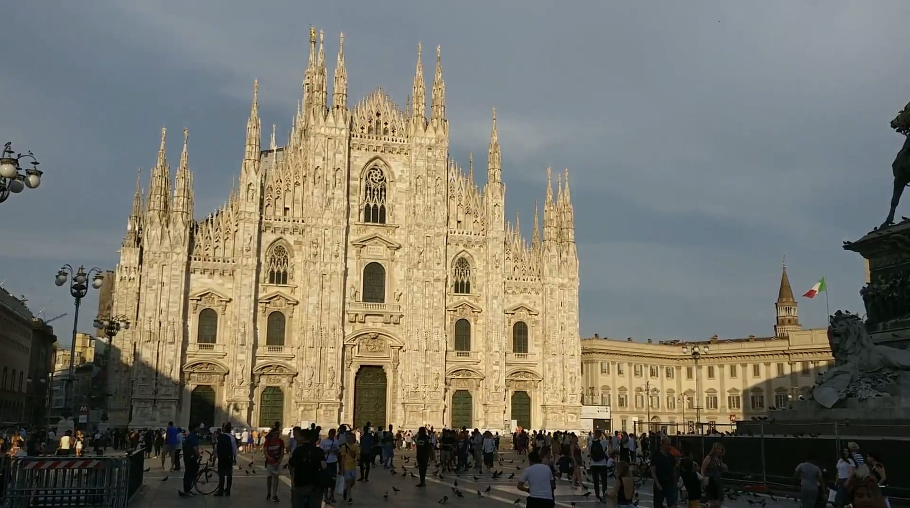

*Duomo di Milano*

### Pisa

Dari Milan naik bis ke Pisa. Di Pisa ada... Menara Pisa. 

Pas sampe sini baru berasa kalo gua lagi jalan-jalan di Eropa. Rasanya ngeliat bangunan yang selama ini cuma ngeliat di buku-buku pas SD ituu... Cobain sendiri deh ya haha

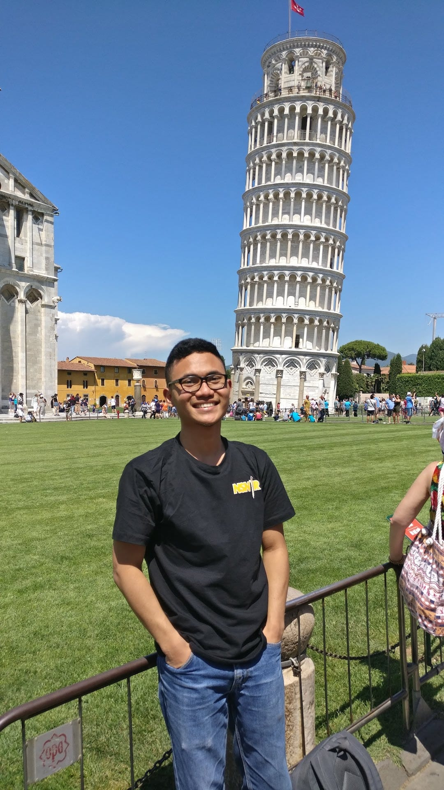

### Florence

Dari Pisa pas hari itu juga langsung lanjut ke Florence. Gua ke kota ini karena Florence itu kota pusat pas zaman Rennaisance. Disana muter-muter museum ngeliat hasil karya Leonardo da Vinci dan kawan-kawan. Menurut gua kalo orang punya jiwa seni wajib banget kesini sih, siapa tau bisa ngeliat apa yang membuat karya karya tersebut dibilang legendaris sampe sekarang.

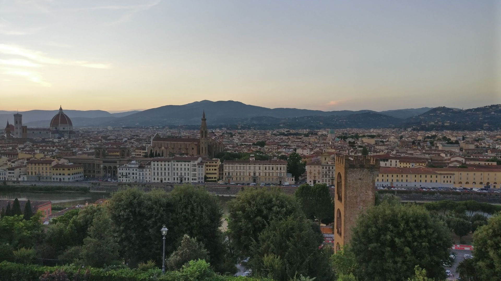

*Naik bukit buat ngeliat pemandangan ini*

### Roma

Dari Florence naik kereta ke Roma. Roma kece banget. Gua nyesel cuma 2 hari disana. Keliling Colosseum itu makan waktu sehari. Dan di sekitar Colosseum itu banyak tempat historis yang gua ngga sempet ngunjungin kayak Roman Plaza.

Untungnya pas disana masih sempet buat ngunjungin Vatikan. Gua baru sadar Vatikan tuh kecil banget. Lebih kecil dari perumahan rumah gua. Orang luar itu cuma bisa masuk bagian museum dan Sistine Chapel dari Vatikan. Colosseum dan Sistine Chapel itu keren abis. Pengen kesana lagi sih suatu hari insyaallah.

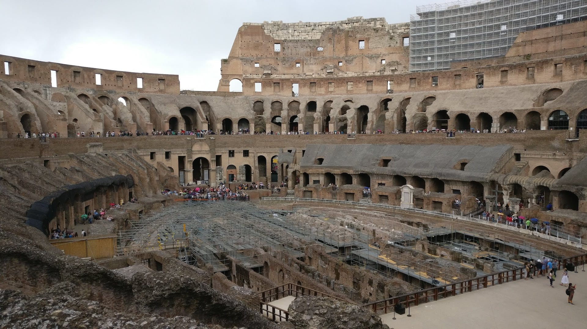

### Aarhus

Empat tahun yang lalu ada lomba yang kalo kita bisa lolos seleksi bakal berangkat lomba ke Aarhus, Denmark. Empat tahun lalu gua gagal lolos seleksinya. Sejak hari itu, hati kecil gua pengen ke sana. Masyaallah kemaren kesampean. Tujuan kesana cuma mau foto sama tulisan Aarhus doang sih haha

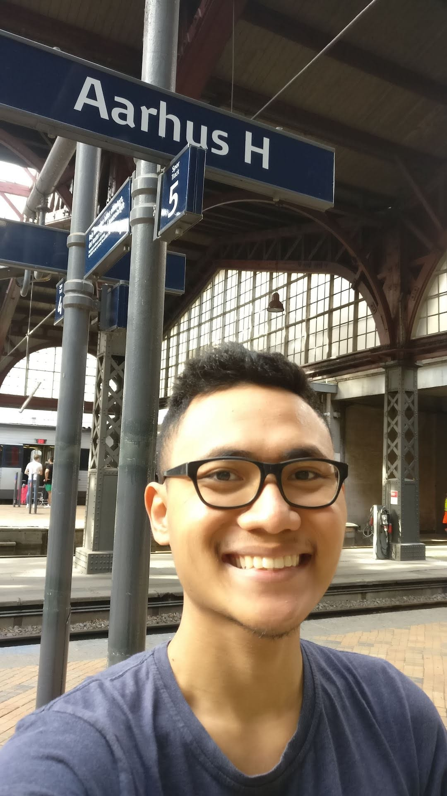

*Masyaallah. Muka gua gede banget ya.*

### Copenhagen

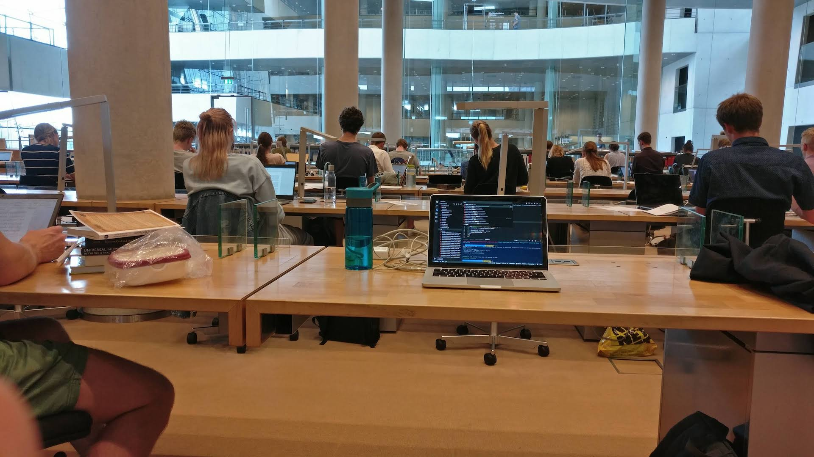

*Karena kemarin sambil jalan-jalan sambil ngerjain proyek. Kadang mampir perpus-perpus disana*

Kemarin ke Copenhagen karena tanggung aja karena udah dari Aarhus. Kota nya damai banget, ngga serame ibukota ibukota di Eropa lain. Mayan lah udah pernah nyobain negara Scandinavia.

### Brussel

Dari Copenhagen dapet tiket murah ke Brussel, Belgia. Disini terkenalnya ada markas European Union, dan ada Mannekin Pis, patung bocah pipis. Seperti kata orang-orang, Mannekin Pis biasa banget. Sebenernya gua nulis ini salah juga sih, karena membantu membuat Mannekin Pis terkenal walaupun ngga ada yang spesial haha.

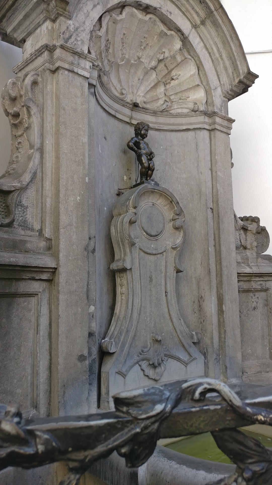

*Mannekin Pis. Aslinya ngga jauh beda dari foto.*

### Den Haag

Setelah beberapa minggu perjalan sendiri, di kota ini gua udah janjian jalan-jalan sama Alief, temen SD gua. Mantepnya Alief nih punya kenalan guru di Den Haag. Jadi selama 2 hari kita muter-muter Den Haag. Disini banyak banget orang Indo. Kedutaan Indo aja adanya di Den Haag, bukan di Amsterdam. Selama kita muter-muter disana pasti ketemu orang Indo di setiap sudut kota.

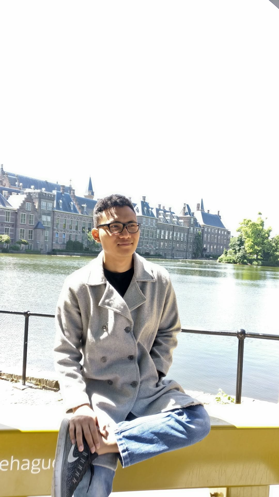

*Kata emak gua difoto ini gua kayak artis. Padahal jasnya dapet gratisan dari mesjid karena kemaren dingin banget disana dan gua cuma bawa kaos.*

### Amsterdam

Dari Den Haag gua sama Alief lanjut ke Amsterdam. Disini gua sama Alief nyewa sepeda buat sehari. Menyusuri kanal-kanal kecil. Menghirup asap ganja. Naik ferry melintasi sungai. Foto-foto make sepeda. Menghirup asap ganja lagi. Ke Red Light District pas siang-siang. Ke Mesjid buat tobat haha.

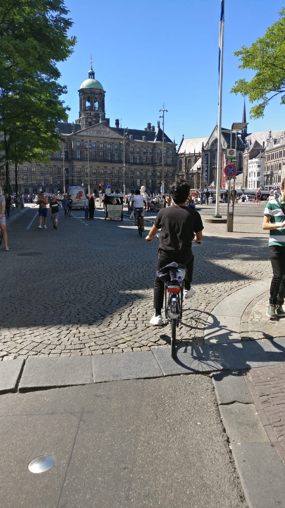

*Puluhan kali nyoba video sambil lepas tangan ngga ada yang bagus. Yang ada hampir nyebur sungai.*

### Paris

Di kota-kota lain gua cuma 1-2 hari. Di Paris 2.5 hari. Dan kuranggggg. Banyak banget yang pengen diliat. Kotanya gede banget. Di Eiffel aja kemarin seharian cuma duduk disana ngga bosen-bosen. Pas naik Eiffel diatas seharian ngga bosen bosen. Museum Louvre kalo mau mantengin Mona Lisa nya aja boleh sehari kalo mau dan ngga diusir satpam. Belum koleksi-koleksi Louvre yang lain. Belum tempat-tempat lain kayak Versailles.

Dan rada sedih karena kemarin kesini sendiri haha. Kalo diberi kesempatan sama Allah pengen kesini lagi 😉

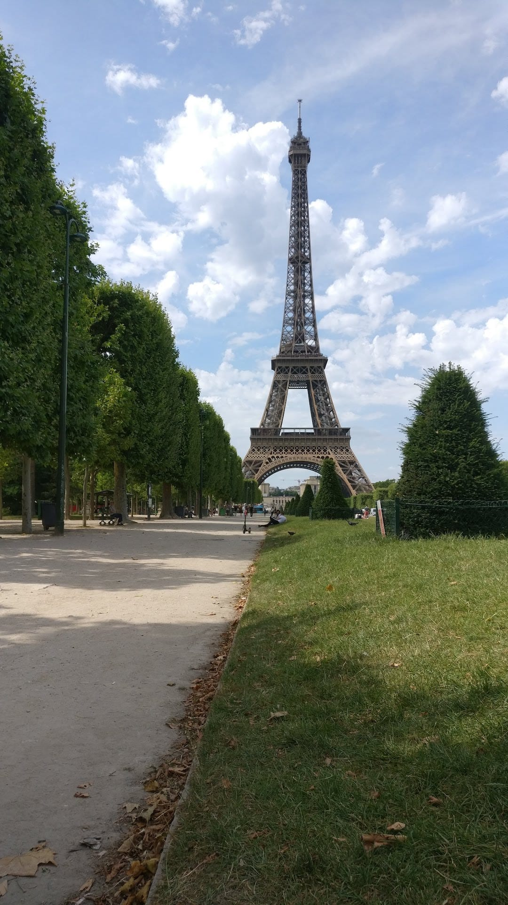
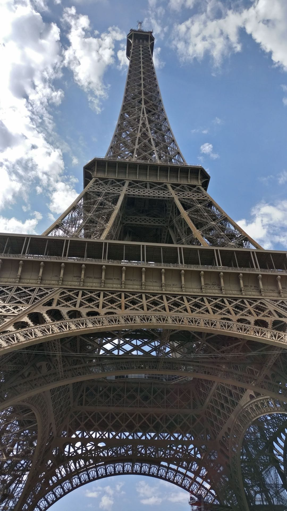

*Tinggal di Jerman 6 bulan kadang lupa kalo lagi di Eropa. Pas jalan-jalan kesini baru inget lagi. #kurangbersyukur*

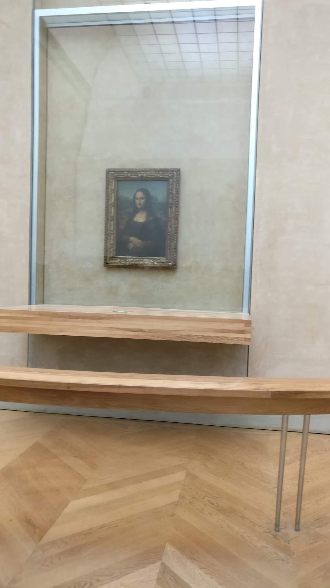

*Bibi Mona Lisa dilihat dari jarak beberapa meter*

### Barcelona

Kemarin sebenernya tiket ke Barcelona mahal banget. Kalo tiket pesawat lain <20 euro. Ke Barcelona ~50 euro. Tapi apa daya pengen merasakan semua negara besar di Eropa.

Yang paling berkesan pas di Barcelona itu ketemu cewe Australia namanya Amanda. 

Selama perjalan gua ngga pernah ngajakin ngobrol orang buat ngajakin jalan-jalan atau makan bareng. Waktu di Barcelona gua satu kamar hostel sama Amanda dan satu cewe lain dari Chile. Abis kenalan ngobrol-ngobrol biasa, tiba-tiba si Amanda dengan gampangnya ngajakin makan malem gua dan Cewe Chile itu.

Gua langsung reflek nolak dong, bilang mohon maaf gua udah ada rencana malem ini (rencana ke mesjid doang si haha). Nah cewe Chile ini nerima. Trus gua mikir, "yeelah sekali-kali hang out bareng lah." Yaudah gua terima, dan kita turun ke lobby buat siap-siap.

Sampe di lobby, ada cowo baru dateng, baru check-in di hostel. Trus si Amanda langsung nyamperin cowo ini, ngobrol-ngobrol nanyain dari mana, abis itu diajakin makan juga. Cowo Jerman ini langsung nolak juga kan kayak gua. Abis itu gua cerita ke Cowo Jerman kalo gua juga baru tiba-toba diajak si Amanda ini. Akhirnya dia mau ikut. Malem itu kita makan bareng trus muter muter Barcelona.

Gua kagum banget sama si Amanda ini. Bisa se ekstrovert dan se "gaul" itu, sambil bisa ngerasain perasaan orang lain. Gua yang tadinya kesepian selama perjalanan, jadi punya temen ngobrol walaupun cuma semalem itu.

*Guidi*

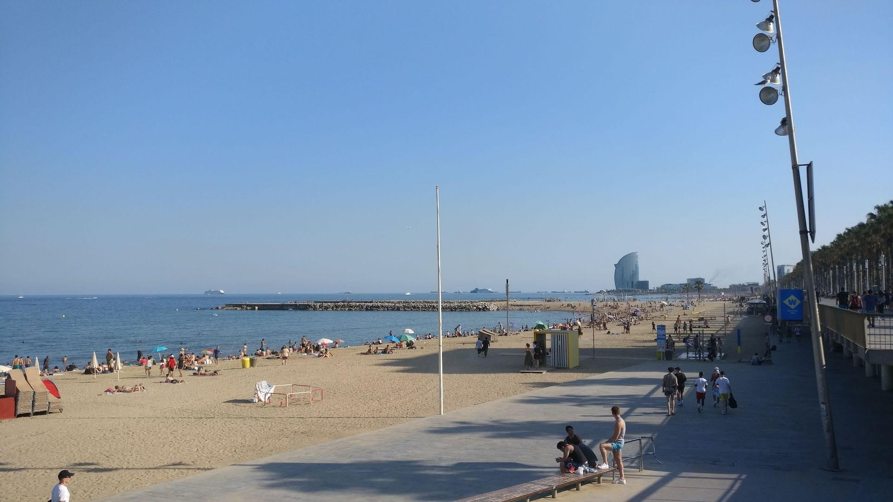

*Pantai Barcelona.*

### Zürich

Dari Barcelona terbang lagi ke Zürich, Swiss. Kota nya okeee banget. Kota destinasi terakhir ngga mengecewakan. Bersih, modern, damai, tentram, sejahtera. Disini berasa banget orang-orangnya punya standar hidup yang tinggi. Satu yang disayangkan adalah apa-apa lebih mahal. Döner kebab di kota lain 3-5 euro. Di Zürich bisa 10 euro haha. Tapi harusnya masih seimbang sama gaji yang didapetin sama orang disana.

Salah satu tujuan ke Zürich kemarin itu buat ngeliat ETH Zürich, bisa dibilang universitas nomor satu di Eropa. Dari stasiun, gua jalan ngikutin google maps ke ETH. Naik bukit, muter-muter. Sampe di ETH nya... Keren. Gedungnya mantep. Pemandangan dari kampusnya subhanallah. Akademiknya nomor satu. Gua baru kesana sebagai turis aja udah bangga.

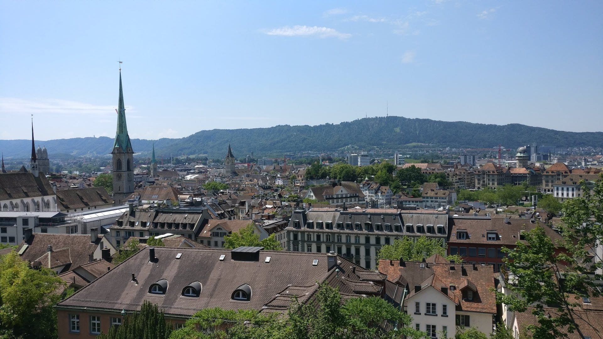

*Pemandangan dari ETH Zürich. Aslinya lebih keren lagi.*

### 