Aku sering lupa untuk apresiasi hal yang aku miliki. Disini aku bercerita tentang ibuku, ayahku, dan Jamal, sebagai rasa syukur ku memiliki mereka selama ini.

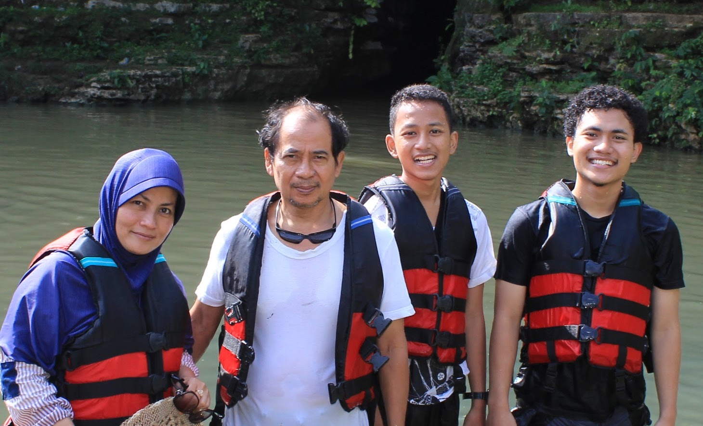

## Ayah

Ayahku itu orang yang paling aneh sedunia yang aku tau. Jalan pikirnya bener-bener beda sama orang biasanya. 

Pak Hambali lahir di Kudus, dan masa kecilnya diisi dengan melihara kuda, main gundu, jualin gundu ke temennya abis menang main, melihara ayam, main di sawah, dan tidur di mushola layaknya bocah kampung lainnya, emang bocah kampung sih. Semua orang di kampung kaget, pas kelas 6 SD, tiba-tiba ayahku kabur dari Kudus ke Jakarta.

Yup, ayahku lari dari rumah, ke Jakarta, pas kelas 6 SD.

Alesan ayahku lari ngga gitu jelas. Ayahku pernah bilang waktu itu lagi ribut sama kakekku, dan juga terinspirasi dari anak lurah yang bisa hidup di Jakarta dengan jualan koran. Apapun alesannya, Ayahku kabur dari rumah cuma berbekal uang hasil jual ayam piaraannya. Ngga punya alamat tujuan. Cuma punya nama "Sulaiman," omku yang duluan ke Jakarta jadi pembantu rumah tangga.

Sampe di Jakarta, ayahku nanya orang di pinggir jalan, "Mas, kenal Pak Sulaiman?"

Yakali yah. Jakarta luas banget. Mana bisa ketemu orang dengan tau nama nya doang. Ayahku pun terlantar di Jakarta sendirian. Ngga punya kenalan. Ngga punya tempat tinggal.

Entah gimana tiba-tiba ada orang yang kenal sama Pak Sulaiman. Dan ayahku dianter ke tempat beliau. Sejak itu, ayahku tinggal dan sekolah di Jakarta. Alhamdulillahnya ayahku rajin, dan seperti diangkat jadi anak angkat sama suatu keluarga di sana. Ayahku disekolahin, dan pas pulang sekolah bantu dirumah jadi pembantu rumah tangga.

Kehidupan di Jakarta pun ngga mulus mulus aja. Ayahku sering kerja sambilan jadi tukang bangunan, jadi kenek bis, jadi apapun yang penting bisa buat makan dan kuliah. Udah kerja, sekolahnya pun tetep fokus. Sering banget ayahku cerita kalo dia pas SMP selalu juara satu dikelas.

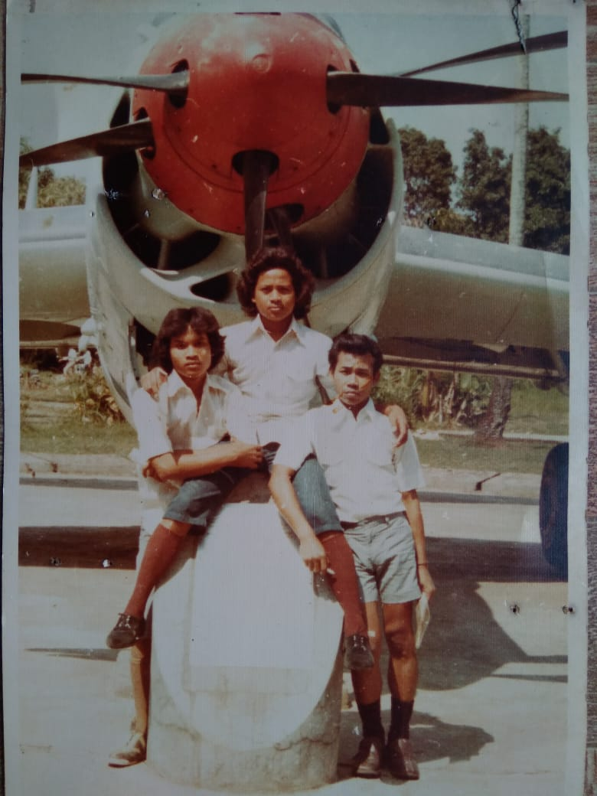

*Ayahku yang ditengah. Ayahku sering ngebanggain dia dari jaman dulu udah make celana dibawah lutut. Walaupun dulu dibilang aneh.*

Kelakuan anehnya ngga cuma disitu. Pas lulus sekolah ayahku dapet kerja di BUMN yang gajinya gede, yang diidam idamin kebanyakan orang. Ayahku malah keluar kerja sambil ngejalanin bisnis sampingan.

Pernah jadi peneliti di UI. Disekolahin sama WHO ke Australia. Udah tinggal bentar lagi lulus, malah keluar dari UI, cuma karena ngerasa kurang cocok sama pembimbingnya. Padahal kalo dilanjutin mungkin sekarang udah jadi Professor Hambali.

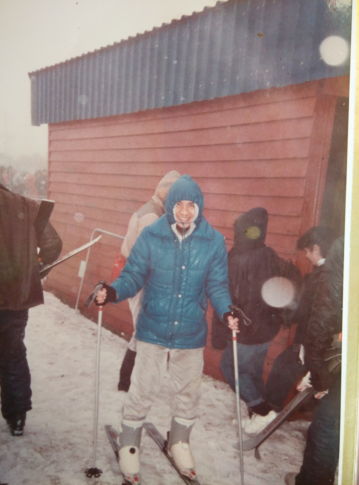

*Ayahku di Australia. Dulu salah satu cita-citaku mau ngalahin ayahku dengan pergi ke negeri lain yang lebih keren dari Australia.*

Kelakuan yang rada anehnya pun diterapin pas ngedidik anak-anaknya.

Prinsip ayahku, kalo untuk belajar, uang berapapun boleh dikeluarin. Mau jual tanah, gadai emas, harus dilakuin kalo untuk pendidikan. Sedangkan kalo buat beli baju, 50rb aja udah kemahalan. Contoh konkritnya, dua tahun lalu aku dan Jamal gaya-gayaan buat bikin startup, dan butuh uang 10jt. Kata ibuku ngapain 10jt, mendingan 1jt aja dulu. Tapi ayahku tetep ngebelaain buat nyediain uang 10jt, karena ayahku yakin itu cara yang terbaik buat kami belajar. Beberapa hari setelahnya aku baru tau kalo ternyata gelang emas ibuku harus digadai buat dapetin uang segitu haha.

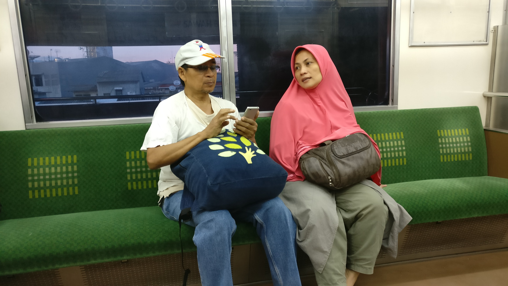

*Ayah dan ibu. Salah satu hobi ayahku itu make baju robek.*

Dari dulu saya dan Jamal selalu disuruh untuk belajar yang lebih dari yang lain. Kalo misalkan SD, kalo bisa udah ngerti pelarajan SMP. Pas SMP, kalo bisa udah ngerti pelajaran SMA. Pas SMA, kalo bisa udah ngerti pelajaran kuliah. Nah kalo kuliah?

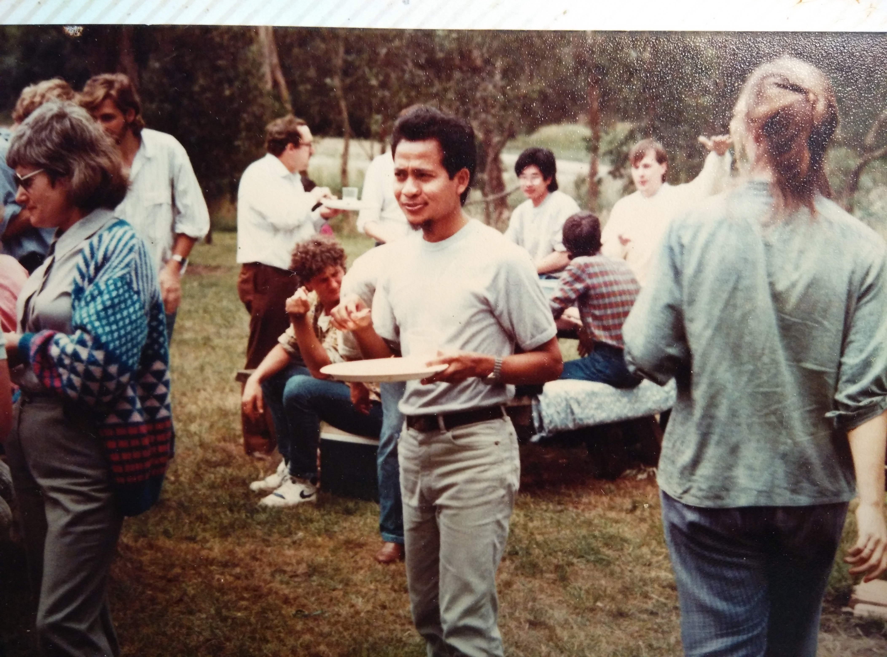

*Sama, ayahku di Australi juga.*

Makanya sekarang walaupun udah kuliah, saya masih kadang-kadang di suruh ayah saya keluar kuliah. Katanya kuliah terlalu normatif. Dan di luar sana banyak cara buat dapet ilmu yang lebih cepet dan lebih efisien.

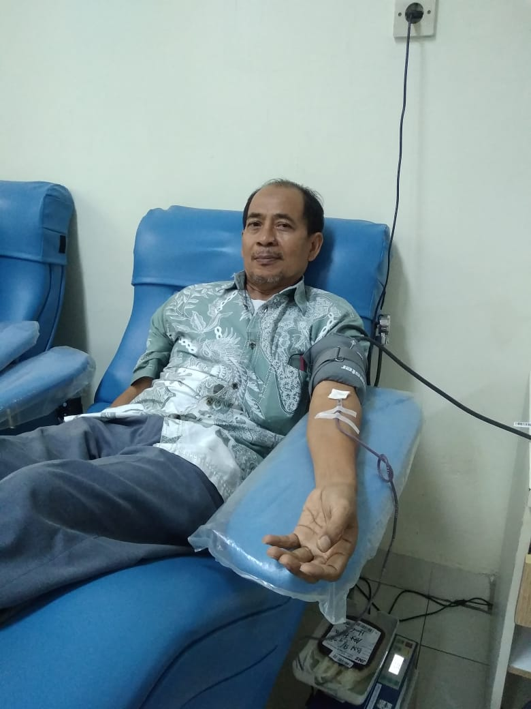

*Pak Hambali beberapa bulan yang lalu lagi donor darah.*

## Ibu

Kalo ayah gua nyuruh keluar kuliah, untungnya ada ibu gua. Setiap ayah gua nyuruh drop out kuliah, ibu gua selalu ngebilangin buat lanjut kuliah.

Kalo ayah gua diibaratin api, ibu gua itu kayak air yang siap memadamkan kalo apinya udah terlalu besar.

Bu Nurul lahir di Bogor, walaupun masa kecilnya banyak diabisin di Ponorogo. Ibu saya juga ngga kalah pinter nya sama ayah saya. Ibuku sering cerita dulu pas sekolah jago ngerjain integral, kalo dikasih rumusnya.

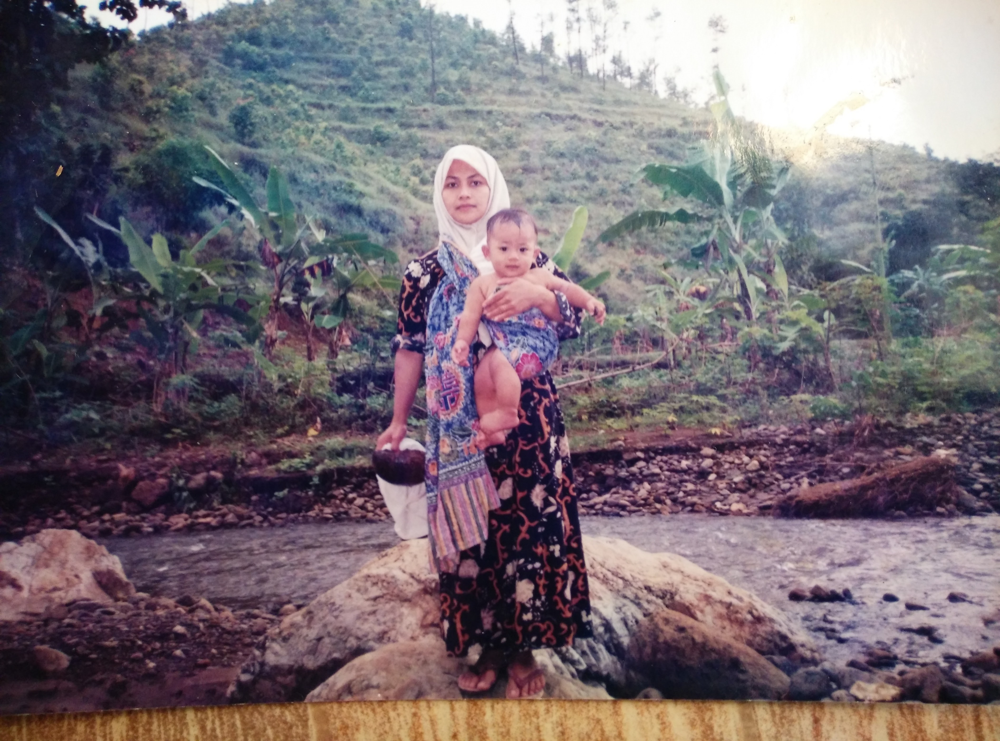

*Aku dan ibuku di sungai belakang rumah di Ponorogo*

Walaupun tidak seekstrim ayahku, ibuku juga orang yang sangat sederhana. Kalo abis belanja di ITC Depok, ibuku suka tebak-tebakan berapa harga daster yang abis dibeli. Biasanya ibuku yang menang karena harga dasternya murah banget tidak terduga-duga. Meskipun begitu ibuku tetep seperti ibu-ibu. Pas aku ke Jerman kemaren ibuku ngode-ngode terus buat dibeliin tas asli dari Jerman haha. Wajar aja bu, kapan lagi anaknya ke luar negeri hehe.

Bu Nurul itu orangnya penyayang banget. Jarang banget saya dimarahin, kecuali kalo pas bangunin buat sholat subuh. Dulu inget banget pas saya kecil, pernah dimarahin. Tapi abis dimarahin, malah ibu saya yang minta maaf dong. Waktu itu bingung juga saya. Kenapa saya yang dimarahin tapi malah ibu saya yang minta maaf.

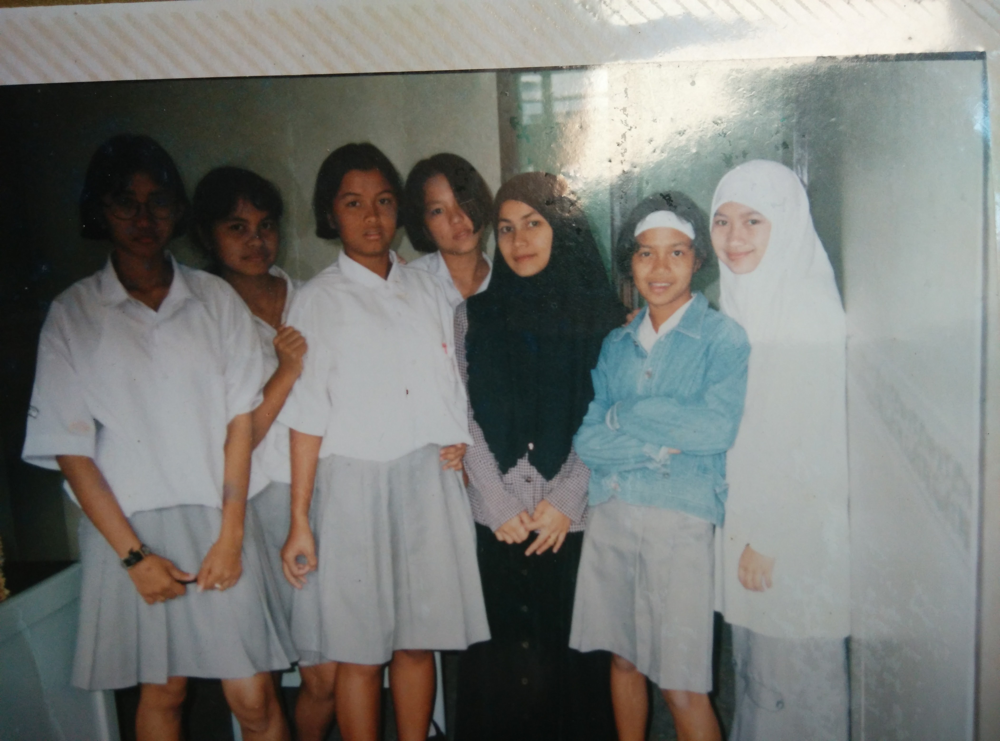

*Ibuku, yang make kerudung hitam di tengah, pas masih ngajar SMA.*

Salah satu yang paling aku syukuri itu betapa dedikasinya ibuku untuk ngedidik anak-anaknya. Dulu sebelum saya lahir, ibuku sempet ngajar di suatu SMA. Tapi sejak aku lahir, ibuku berenti ngajar. Dan sejak itu, ibuku kerja full-time untuk ngedidik aku dan Jamal.

Kalo ayahku lebih fokus ngedidik untuk masalah duniawi, ibuku yang nyiapin untuk masalah akhirat. Dulu pas saya lagi di luar negeri, kalo lagi nelfon, pasti yang pertama ditanya udah sholat atau belum. Pas kecil inget banget sebelum tidur pasti diceritain kisah-kisah nabi. Sikap dan perilakunya mencerminkan ibu yang sangat muslimah. Kalo ibu-ibu lain suka ngomongin orang lain dari belakang, kayaknya ibuku jarang banget ngegibahin orang. Ngga heran kalo sekarang jadi ketua pengajian ibu-ibu di komplek haha.

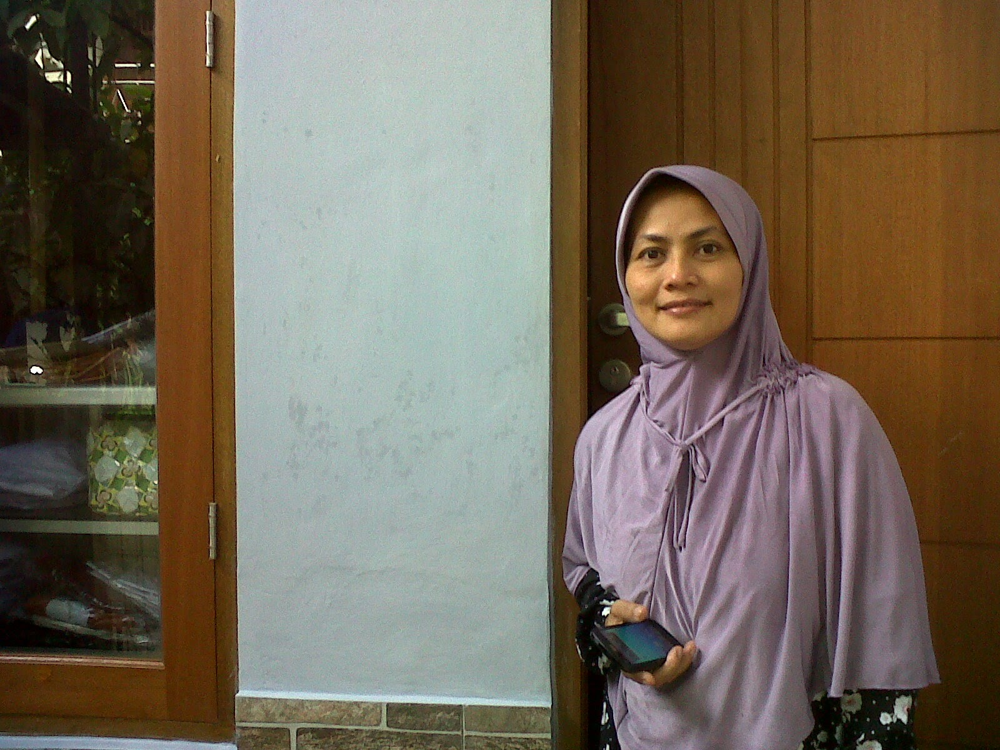

*Bu Nurul di depan rumah.*

## Jamal

Namanya saudara, kadang aku dan adekku Jamal suka dibanding-bandingin. Kalo kata ayahku, Jamal itu orangnya jago banget bergaulnya. Ayahku cerita, kalo nganter Jamal sekolah, pas sampe sekolah, pasti langsung banyak banget yang nyapa Jamal. Sedangkan kalo ayahku nganter aku, ngga ada sama sekali yang nyapa haha.

Emang ngga diragukan sih kemampuan sosialnya. Pernah Jamal main bareng sama temen-temen kuliahku. Baru jalan beberapa menit Jamal udah apal nama nama temenku, dan udah bisa nebak sifat-sifat orangnya kayak gimana. Kalo aku, baru satu detik nanya nama orang aja masih sering lupa.

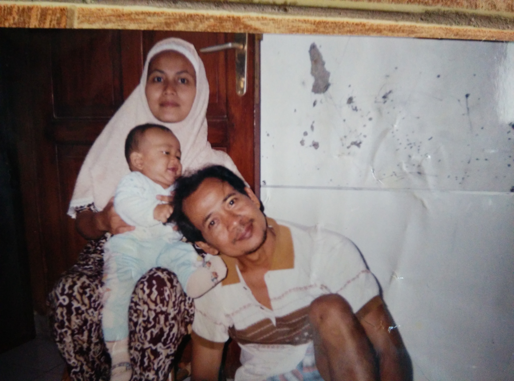

*Jamal pas kecil suka jambak rambut.*

Saat ini Jamal lagi tertarik di dunia per esport, terutama Dota. Kadang waktu kosongnya dipake buat main Dota, sampe bisa menang turnamen Dota se-kampusnya. Walaupun gitu, salah satu impian dia sekarang ini jadi caster, atau komentator, untuk turnamen-turnamen Dota gitu. Kalo lagi dirumah pun salah satu kerjaannya emang nontonin komentator komentator Dota, sampe cepet banget hafal kata-kata yang biasa dipake sama komentator luar negeri.

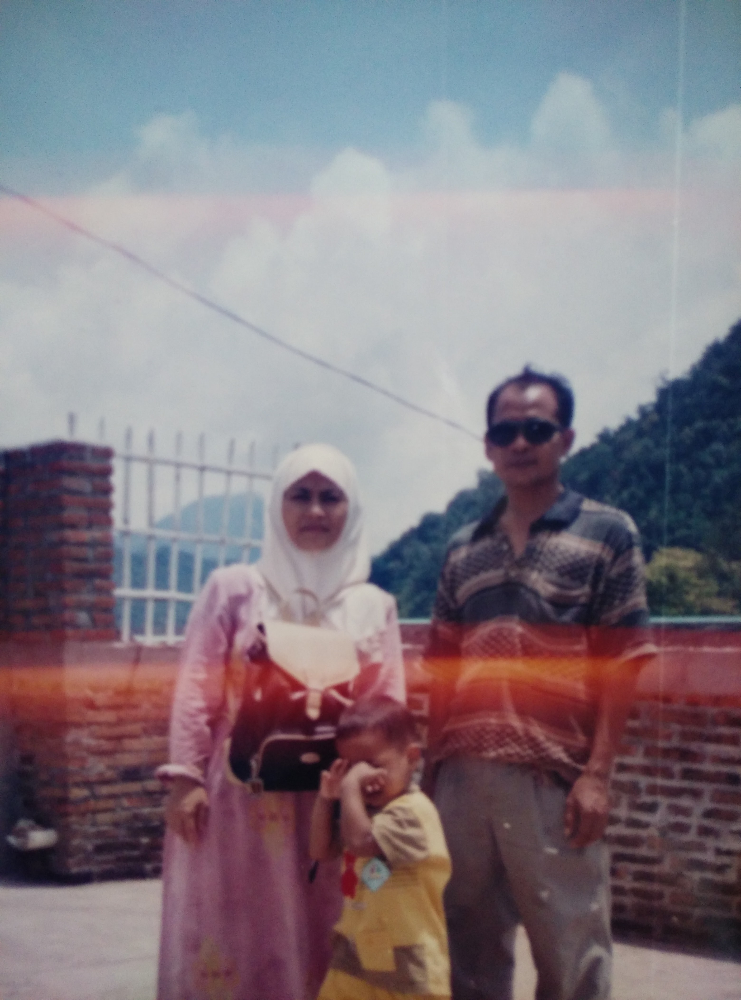

*Jamal pas kecil kalo difoto suka nonjok mukanya. Sampe sekarang ngga ada yang tau maksudnya apa.*

Di mata orang tua kami, mungkin aku terlihat udah banyak pencapaian duniawinya. Menang ini lah itu lah, udah pernah kesini lah kesana lah. Kayaknya Jamal ngerasa beban juga karena sering dibandingin sama aku. Sampe pernah ngomong,

"Ah aku ngerasa belum pernah ada sukses sama sekali deh. Nyoba apa-apa masih gagal terus."

Tenang aja mal. Orang waktunya beda-beda. Coba kita lihat aja sama-sama 10, 20, atau 30 tahun lagi apakah kalimat itu masih berlaku atau ngga :)