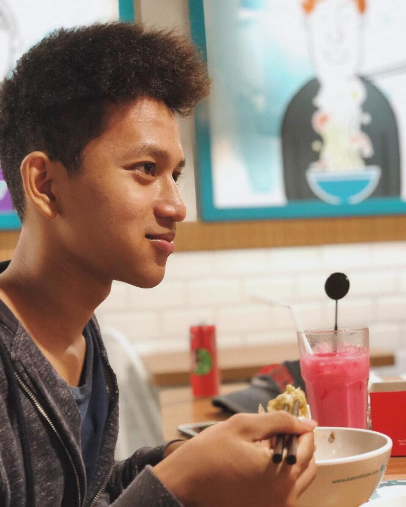

Aku sering lupa untuk apresiasi hal yang aku miliki. Disini aku bercerita tentang ibuku, ayahku, dan Jamal, sebagai rasa syukurku memiliki mereka selama ini.

## Ayah

Ayahku itu orang yang paling aneh sedunia yang aku tau. Jalan pikirnya bener-bener beda sama orang biasanya. 

Pak Hambali lahir di Kudus. Masa kecilnya diisi dengan melihara kuda, main gundu, jualin gundu ke temennya abis menang main, melihara ayam, main di sawah. Semua orang di kampung kaget, pas tamat SD, tiba-tiba ayahku kabur dari Kudus ke Jakarta.

Yup, ayahku lari dari rumah, ke Jakarta setelah tamat SD.

Alesan ayahku lari ngga jelas. Ayahku pernah bilang waktu itu lagi ribut sama kakekku, atau juga terinspirasi dari anak lurah yang bisa hidup di Jakarta dengan jualan koran. Apapun alesannya, ayahku kabur dari rumah cuma berbekal uang hasil jual ayam piaraannya. Ngga punya alamat tujuan. Cuma punya nama "Sulaiman," omku yang duluan ke Jakarta jadi pembantu rumah tangga.

Sampe di Jakarta, ayahku nanya orang di pinggir jalan, "Mas, kenal Pak Sulaiman?"

Yakali yah. Jakarta luas banget. Mana bisa ketemu orang dengan tau nama nya doang. Ayahku pun terlantar di Jakarta sendirian. Ngga punya kenalan. Ngga punya tempat tinggal.

Entah gimana tiba-tiba ada orang yang kenal sama Pak Sulaiman. Dan ayahku dianter ke tempat beliau. Sejak itu, ayahku tinggal dan sekolah di Jakarta. Kehidupan di Jakarta pun ngga mulus mulus aja. Ayahku sering kerja sambilan jadi tukang bangunan, jadi kenek bangunan, jadi apapun yang penting bisa buat makan dan sekolah.

*Ayahku yang ditengah. Ayahku sering ngebanggain dia dari jaman dulu udah make celana dibawah lutut. Walaupun dulu dikatain aneh.*

Kelakuan aneh ayahku ngga cuma lari dari kampung aja. Pas lulus sekolah ayahku dapet kerja di BUMN yang gajinya gede, yang diidam-idamkan banyak orang. Walaupun begitu, ayahku malah ganti kerjaan biar bisa kuliah lebih baik.

Ayahku pernah juga jadi peneliti di UI. Disekolahin sama WHO ke Australia. Udah tinggal bentar lagi lulus, malah keluar dari UI, cuma karena ngerasa kurang cocok sama atasan.

*Ayahku di Australia. Dulu salah satu cita-citaku mau ngalahin ayahku dengan pergi ke negeri lain yang lebih keren dari Australia.*

Kelakuan yang rada anehnya pun diterapin pas ngedidik anak-anaknya.

Prinsip ayahku, kalo untuk belajar, uang berapapun boleh dikeluarin. Mau jual tanah, gadai emas, harus dilakuin kalo untuk pendidikan. Sedangkan kalo buat beli baju, 50rb aja udah kemahalan. Contoh konkritnya, dua tahun lalu aku dan Jamal gaya-gayaan buat bikin startup, dan butuh uang 10jt. Kata ibuku ngapain 10jt, mendingan 1jt aja dulu. Tapi ayahku tetep ngebelaain buat nyediain uang 10jt, karena ayahku yakin itu cara yang terbaik buat kami belajar. Beberapa hari setelahnya aku baru tau kalo ternyata gelang emas ibuku harus digadai buat dapetin uang segitu haha.

*Ayah dan ibu. Salah satu hobi ayahku itu make baju robek.*

Dari dulu saya dan Jamal selalu disuruh untuk belajar yang lebih dari yang lain. Kalo misalkan SD, kalo bisa udah ngerti pelarajan SMP. Pas SMP, kalo bisa udah ngerti pelajaran SMA. Pas SMA, kalo bisa udah ngerti pelajaran kuliah. Nah kalo kuliah?

Makanya sekarang walaupun udah kuliah, saya masih kadang-kadang di suruh ayah saya keluar kuliah. Bukannya ayahku ngga suka orang kuliah. Ayahku cuma mau ngajarin, jangan sampe aku ngelakuin sesuatu karena ikut orang-orang lain. Tapi harus ngelakuin sesuatu karena emang sesuatu itu yang menurut kita terbaik untuk dilakukan.

*Pak Hambali beberapa bulan yang lalu lagi donor darah.*

## Ibu

Kalo ayahku nyuruh keluar kuliah, untungnya ada ibuku. Setiap ayahku nyuruh drop out kuliah, ada ibuku yang selalu ngebilangin buat lanjut kuliah.

Kalo ayahku diibaratin api, ibuku itu kayak air yang siap memadamkan kalo apinya udah terlalu besar.

Bu Nurul lahir di Bogor, dan masa kecilnya banyak diabisin di Ponorogo. Ibu saya juga ngga kalah pinter nya sama ayah saya. Ibuku sering cerita dulu pas sekolah jago ngerjain integral, kalo dikasih rumusnya.

*Aku dan ibuku di sungai belakang rumah di Ponorogo*

Walaupun tidak seekstrim ayahku, ibuku juga orang yang sederhana. Kalo abis belanja di ITC Depok, ibuku suka tebak-tebakan berapa harga daster yang abis dibeli. Biasanya ibuku yang menang karena harga dasternya murah banget tidak terduga-duga. Meskipun begitu tetep ada sifat keibuannya. Pas aku ke Jerman kemaren ibuku ngode-ngode terus buat dibeliin tas asli dari Jerman haha. Wajar aja bu, kapan lagi anaknya ke luar negeri hehe.

Salah satu contoh sederhananya ibuku dan kasih sayangnya sama anaknya, ibuku itu sering makan nasi kemarin. Kalo masak nasi, ibuku biasanya selalu ngelebihin nasinya, biar selalu ada nasi kalo anaknya mau nambah. Tapi kadang nasinya jadi ngga abis kan. Nah ibuku biasanya makan nasi yang ngga abis, tapi tetep masak nasi baru, biar anaknya selalu makan nasi yang enak.

*Ibuku, yang make kerudung hitam di tengah, pas masih ngajar SMA.*

Salah satu yang paling aku syukuri itu betapa dedikasinya ibuku untuk ngedidik anak-anaknya. Dulu sebelum aku lahir, ibuku sempet ngajar di suatu SMA. Tapi sejak aku lahir, ibuku berenti ngajar. Dan sejak itu, ibuku kerja full-time untuk ngedidik aku dan Jamal.

Kalo ayahku lebih fokus ngedidik untuk masalah duniawi, ibuku yang nyiapin untuk masalah akhirat. Dulu pas saya lagi di luar negeri, kalo lagi nelfon, pasti yang pertama ditanya udah sholat atau belum. Pas kecil inget banget sebelum tidur saya dan Jamal pasti diceritain kisah-kisah nabi. Kebanyakan dasar-dasar agamaku aku dapet dari contoh yang dilakuin ibuku.

Sikap dan perilakunya mencerminkan ibu yang sangat muslimah. Kalo ibu-ibu lain suka ngomongin orang lain dari belakang, ibuku ngga ngegibahin orang. Kalo ibu-ibu lain suka banyak drama karena masalah sepele, ibuku sukanya damai dan menyelesaikan masalah tanpa menyakiti hati orang lain. Ngga heran kalo sekarang jadi ketua pengajian ibu-ibu di komplek haha.

Semoga anak-anaknya tetep istiqomah ngikutin ajaran ibunya hehe.

*Bu Nurul di depan rumah.*

## Jamal

Namanya saudara, kadang aku dan adekku Jamal suka dibanding-bandingin. Kalo kata ayahku, Jamal itu orangnya jago banget bergaulnya. Ayahku cerita, kalo ayahku nganter Jamal sekolah, pas sampe sekolah, pasti langsung banyak banget yang nyapa Jamal. Sedangkan kalo ayahku nganter aku, ngga ada sama sekali yang nyapa haha.

Emang ngga diragukan sih kemampuan sosialnya. Pernah Jamal main bareng sama temen-temen kuliahku. Baru jalan beberapa menit, Jamal udah hafal nama-nama temenku, dan udah bisa nebak sifat-sifat orangnya kayak gimana. Kalo aku, baru satu detik nanya nama orang aja masih sering lupa.

Karena dari dulu sering dibanding-bandingin, aku ngga mau kalah kan. Emang cuma Jamal doang yang bisa bergaul. Aku sering niru-niru, atau belajar dari Jamal gimana cara berteman yang benar. Bisa dibilang kemampuan bergaul aku sekarang aku dapetin dari Jamal. 

*Jamal pas kecil suka jambak rambut.*

Saat ini Jamal lagi tertarik di dunia per esport, terutama Dota. Kadang waktu kosongnya dipake buat main Dota, sampe bisa menang turnamen Dota se-kampusnya. Salah satu impian dia sekarang ini jadi caster, atau komentator, untuk turnamen-turnamen Dota gitu. Kalo lagi dirumah pun salah satu kerjaannya emang nontonin komentator komentator Dota, sampe cepet banget hafal kata-kata yang biasa dipake sama komentator luar negeri.

*Jamal pas kecil kalo difoto suka nonjok mukanya. Sampe sekarang ngga ada yang tau maksudnya apa.*

Di mata orang tua kami, mungkin aku terlihat udah banyak pencapaian duniawinya. Menang ini lah itu lah, udah pernah kesini lah kesana lah. Sedangkan Jamal mengambil jalan yang mungkin terlihat kurang baik di kalangan orang tua. Mungkin Jamal ngerasa beban juga, sampe Jamal pernah ngomong,

"Ah aku ngerasa belum pernah ada sukses sama sekali deh. Nyoba apa-apa masih gagal terus."

Tenang aja mal. Orang waktunya beda-beda. 

Coba kita lihat aja, 10, 20, atau 30 tahun lagi, apakah kalimat itu masih berlaku atau ngga :)

*Jamal sekarang.*